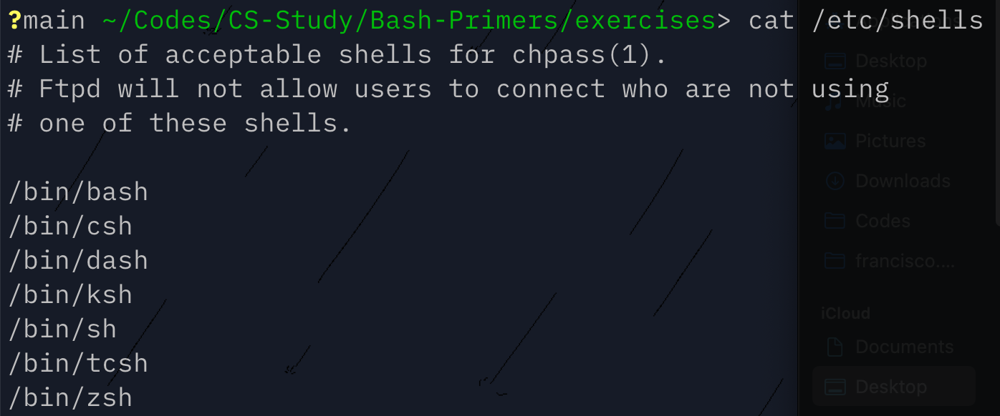
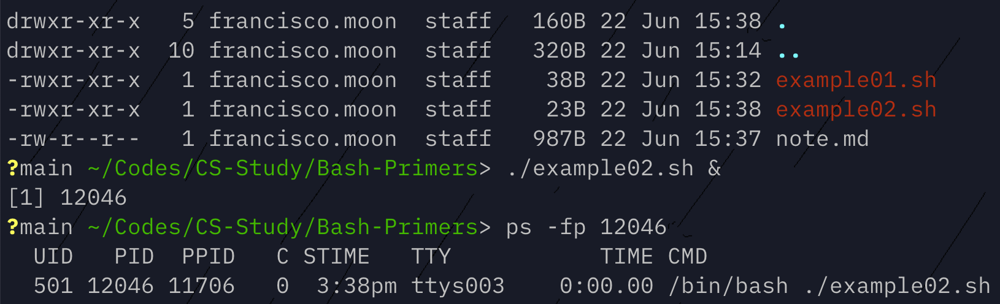
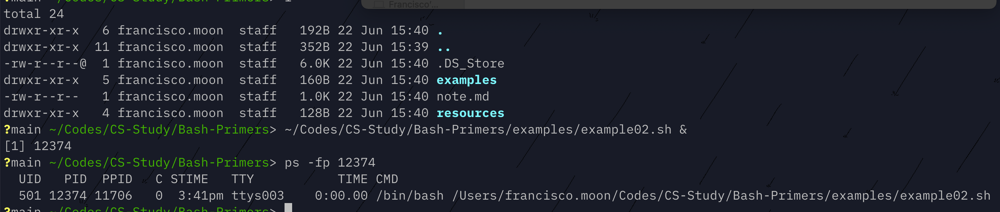
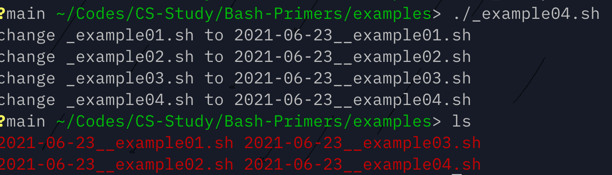

# Shell Scripting

## What is a script?

Simple a series of commands which are taken up by the interpreter - which executes the commands in the script.

*Anything you can type at bash terminal or command line, you can create a script*.

This is main method of automating tasks.

## Shells

You can check what are the available shell environment you can use under `/etc/shells` file. For example...



### Side Note: output redirection

`>` is used in shell environments to redirect the output from one to another file. For instance:

`$ echo "Hello World" > Hello.txt`

This command will create (if `Hello.txt` does not exist) `Hello.txt` and redirect the output of `echo` command/program which took in `"Hello World"` as its argument and put it out on stdout.

To be precise, `>` syntax redirects the file descriptor. For instance, `2> /dev/null` indicates that any `stderr` output will be sent to `/dev/null`. Here, `2` is the file descriptor of `stderr`.

Hence...

```bash
#!/bin/bash
echo "Hello World" > Hello.txt
# this is same statement
# 1 is stdout which is the default
echo "Hello World" 1> Hello.txt
```

## Simple example of script

Suppose that we have a script named `example01.sh` as follows:

```bash
#!/bin/bash
echo "This is example of script"
```

Then, we can execute the script by changing its permission to be executed.

```sh
$ chmod 755 example01.sh
$ ./example01.sh
```

Note that first line begins with `#!` - this indicates to the currently running `sh` environment that which interpreter should be used to run the script. It is possible to have different interpreters such as `csh`, `zsh`, `ksh`, `python3` and so on.

When a script containing `#!` is executed, interpreter is called and path of the script is passed to it as an argument. This can be confirmed by checking the running process of script.




If `#!` is not provided, commands are executed using your current shell; this is highly discouraged as different shells have slightly different syntaxes.

---

[//]:# (Bash Scripting Basics)

## Variables

Just a place to hold a value; name to value binding.

```bash
VARIABLE_NAME="VALUE"
```

Variable name is case sensitive and by convention, it is usually uppercase. It cannot start with number, or contain `-` or `@` symbols.

You can use the variables as follows:

```bash
#!/bin/bash
CURRENT_SHELL="zsh"
echo "I am using $CURRENT_SHELL"
echo "I am using ${CURRENT_SHELL}."
```

`{...}` is used if we need to add another text immediately after it.

It is possible to hold the output of another command to a variable:

```bash
#!/bin/bash
MY_HOSTNAME1=$(hostname)
MY_HOSTNAME2=`hostname`
echo "Script is running on $MY_HOSTNAME1"
```

Second method is the older syntax.

## Tests (Eval)

We want to be able to branch off and perform different actions based on how the condition is evaluates to.

`[ -operators expression ]`

The list of FILE operators are...

```bash
-d FILE			TRUE if FILE is directory
-e FILE			TRUE if FILE exists
-f FILE			TRUE if file exists and is regular file
-r FILE			TRUE if file is readable to you
-s FILE			TRUE if file exists and is not empty
-w FILE			TRUE if file is writable by you
-x FILE			TRUE if file is executable by you
```

The list of string operators are...

```bash
-z STRING		TRUE if STRING is empty
-n STRING		TRUE if string is not empty
STRING1 = STRING2		TRUE if same
STRING1 != STRING2		TRUE if not same
```

The list of arithmetic operators are...

```bash
arg1 -eq arg2		TRUE if same
arg1 -ne arg2		TRUE if not same

arg1 -lt arg2		TRUE if arg1 < arg2
arg1 -le arg2		TRUE if arg1 <= arg2

arg1 -gt arg2		TRUE if arg1 > arg2
arg1 -ge arg2		TRUE if arg1 >= arg2
```

For example,

```bash
[ -e /etc/passwd ]
[ -e /etc/passwd ] && [ -w /etc/passwd ]
[[ -e /etc/passwd && ! -w /etc/passwd || -f /etc/passwd]]
```

## Branch Statements

```bash
if [ condition ]
then
	command 1
elif [ condition ]
then
	command 2
else
	command 3
fi
```

Example:

```bash
#!/bin/bash
if [ $SHELL = "/bin/zsh" ]
then
	echo "Using ${SHELL}!"
fi
```

Note that we can access the shell environment varaibles 🤗.

## Loops

```bash
for VAR in ITEMS
do
	command ...
done
```

Example:

```bash
#!/bin/bash
for DIRECTION in N W E S
do
	echo "DIRECTION: ${DIRECTION}"
done
```

or

```bash
#!/bin/bash
DIRECTIONS="N W E S"
for DIRECTION in $DIRECTIONS
do
	echo "DIRECTION: ${DIRECTION}"
done
```

We can use the output of other programs to iterate through them using `for` loops.

```bash
#!/bin/bash
SCRIPTS=$(ls *.sh)
DATE=$(date +%F)

for SCRIPT in $SCRIPTS
do
	echo "changes ${SCRIPT} to ${DATE}_${SCRIPT}"
	mv ${SCRIPT} ${DATE}_${SCRIPT}
done
```



## Positional Arguements

You can supply arguments (or parameters) to your script in commandline.

`$ script.sh arg1 arg2 arg3`

And they are accessed in script with `$0`, `$1`, and so on.

```bash
$0	=	"script.sh"
$1	=	"arg1"
$2	=	"arg2"
...
$@	=	list of all passed arguments
```

```bash
#!/bin/bash
if [ $1 ]; then
    for ARG in $@; do
        echo "Your argument: [${ARG}]"
    done
else
    echo "No args"
fi
```

## Read from STDIN (user input)

`read -p "PROMPT" VARIABLE`

```bash
#!/bin/bash
read -p "What is your name? " NAME
echo "Hello, ${NAME}"
```

## Exit Status

Every program executed returns a numeric value to indicate the how it has ran and whether it has encountered any problem (reason behind why most programming langauges in `main()` executable function returns a value).

`sh` is no different - every command returns an exit status ranging from 0 to 255.

`0` indicates success; any other value indicates some sort of recoganizable error that other programs or system to deal with.

It is used mainly for error checking - `man` on the command will show more information about what each exit status means and how to handle them.

### Checking for Exit Status

`$?` is a register value containing the return code of last executed command.

```bash
$ ls
$ echo "$?"
```

For example, above code will print out the exit status of `ls` and whether it was able to run without error. For instance, if we try to `ls <some directory doesn't exist>` then `ls` exits with return code `1` which can be checked with `echo "$?"`.

```bash
#!/bin/bash

read -p "Type a hostname to reach: " HOST
ping -c 1 $HOST
EXIT_CODE=$?
if [ "$EXIT_CODE" -ne "0" ]; then
	echo "Host is unreachable"
fi
```

### Exit Statuses and Operators (`&&`, `||`)

```bash
mkdir /tmp/folder1 && cp text.txt /tmp/folder1
```

`AND` operator, `&&` allows us to chain commands such that command following the previous will only execute iff previous command has succedded (returns `0` exit status).

```bash
cp text.txt /tmp/folder1/ || cp test.txt /tmp
```

In comparion, `OR` or `||` allows us to try to execute the first command; if it fails, then second command is executed.

### `;`

To chain multiple commands together regardless of whether they have succeeded or not, we can use `;`.

Commands following the `;` will always be executed regardless whether previous commands have been successful.

`touch text1.txt; echo "hi"`

Above would be same as...

```bash
touch text1.txt
echo "hi"
```

### `exit`

We can explicitly control our own script's exit code via `exit #` command where `#` ranges from 0 to 255.

If none is supplied, then default value would be the last executed command.

```bash
#!/bin/bash
if [ "$?" -ne "0" ]; then
	echo "last command failed"
	exit 1
fi
exit 0
```

In short, know that all command return an exit status ranging from 0 to 255; 0 implies success and any other value is an error which depends on the command.

`$?` contains the previous exit status.

---

## Functions

Repeating codes in the script? Make it a function.

### Creating a function

```bash
function func-name() {
	# codes
}

# keyword function is optional
func-name() {
	# codes
}
```

### Calling a function

```bash
#!/bin/bash
function today() {
	echo "It is now $(date +%r)"
}

function say_hello() {
	echo "Hello!"
	today
}

say_hello
```

We can call functions within a function as well. Note that above, `today` function should be defined BEFORE it is called. As script is *interpreted* and not *compiled* it will execute line by line and will not know where the `today` function is declared.

### Positional Parameters

Functions can also accept parameters: they are stroed in `$1`, `$2`, and so on. `$@` contains all of the parameters.

Note; each function is like its own script; HOWEVER, `$0` will still be the executing script name and NOT the function name.

### Variable Scope

By default, variables are **global**; and each variable has to be defined before using them.

For example, if the variable is defined BEFORE the function is called, we can access it. If not, then we cannot.

```bash
# codes
# if some_function accesses VAR, then this will not work
some_function
VAR=2
```

If the global variable is defined within the function then it will not be available outside of the function **until we call the function**.

```bash
function some_function() {
	SOME_VAR=1
}
# following will fail
echo $SOME_VAR
# following works
some_function
echo $SOME_VAR
```

### Local Variables

Variables declared with keyword `local` can only be accessed within the function.

Best practice is to always declare varaibles within the functions as `local`.

### Exit (Return) Status for Functions

Just like scripts, functions can also return exit status explicitly `return #`. But implicitly, functions return exit status of last executed command in that function.

Likewise, exit codes range from 0 to 255; where 0 indicates success.

```bash
some_function
if [ $? -eq 0 ]; then
	echo "Some function did its job!"
else
	echo "Some function failed..."
	exit 1
fi
```

---

# Shell Script Order && Checklist

1. `sh` scripts should begin with `#!`.
2. `#` comment to summarize what the script is doing.
3. Group list of global variables.
4. Group list of functions using *local* variables.
5. Write the main logic/body ofscript
6. Exit with status.

---

# Wildcards

Wildcards consist of a character or strings that are used for pattern matching.

Globbing expands the wildcard pattern into a list of files and/or directories (paths).

Wildcards are accepted in many commands such as `ls`, `rm`, `cp` and so on.

Two main wildcards are:

`*` matches zero or more characters.
`?` matches exactly one character.

```bash
# will match any file ends with .txt
*.txt
# will match any file begins with abc
abc*

# will match all files with one character length ending in .txt
?.txt
# will match two char named files starting with a
a?
```

## Character Classes `[...]`

`[]` creates a character class which matches any of the characters included between the brackets exactly *one* character.

```bash
# matches sinlge length character either a, e, i, o, or u
[aeiou]
# matches strings begin with either cat or can
ca[nt]*
```

You can negate `[!...]` to exlude set of character classes as well:

```bash
# matches strings that does not begin with a, e, i, o, or u
[!aeiou]*
```

Character class also allows you to define range of consecutive characeters/numbers to match or to exclude as well:

```bash
# matches any string starting with either a, b, c, or d
[a-d]*
# matches a1b, a2b, a3b, or a4b
a[1-4]b
```

Character classes also have set of predefined set of classes such as matching alphabets, alphanumeric values, digits, and so on:

```bash
[[:alpha:]]
[[:alnum::]]
[[:digit::]]
[[:lower::]]
[[:space:]]
[[:upper:]]
```

Sometimes you want to match the wildcard pattern character itself such as `?`; in this case we use escape character `\` with it.

```bash
# matches any string ending with ?
*\?
```

## Wildcards and `sh` scripts

Wildcards are great in case where you want to work with glob of files or directories within the `sh` script.

```bash
#!/bin/bash
# from current directory, copy all text files to temporary bakup folder
cp *.txt /tmp/bakup
```

```bash
#!/bin/bash
# glob also works in the for...in loop
for FILE in $HOME/Documents/*.txt; do
	echo "Backing up $FILE"
	cp $FILE /tmp/backup
done
```

*Always be aware of where the script is running and its `pwd`*. For instance, see following script:

```bash
for FILE in *.txt; do
	echo "Backing up $FILE"
	cp $FILE /tmp/backup
done
```

This can be surprising effect as it will copy different matching `.txt` files depending on **where** the script is running. To make it agnostic about this context, be explict in specifying the files.

---

## `case` statements

```bash
case "$VAR" in
	pattern_1)
		# do commands
		;;
	pattern_2)
		# do commands
		;;
	pattern_N)
		# do commands
		;;
esac
```

Simple application of `case` statement is to starting a service or stopping a service depending on the argument passed:

```bash
#!/bin/bash

case "$1" in
	start|START)
		# start ssh service
		/usr/sbin/sshd
		;;
	stop|STOP)
		# stop running ssh service
		kill $(cat /var/run/sshd.pid)
		;; 
	*)
		echo "Usage: $0 start | stop"; exit 1
		;;
esac
```

---

## Logging in `sh` scripts

Logs conform to 5 Ws *who, what, when, where and why*.

Simple output to terminal will get lost, scroll off the screen and scripts can run unattended (automatically triggered via `cron`).

### `syslog`

`syslog` standard uses factilities and severities to categorize messages:

- facilities: kern, user, mail, daemon, auth, local0, local7
- severities: emerg, alert, crit, err, warning, notice, info, debug

Where to store the log files can be configured:

- `/var/log/messages`
- `/var/log/syslog`

### `logger`

`logger` utility provides a way to log messages (by default, `user.notice`).

```bash
logger "Message"
```

---

## `while` loops

```bash
while [ condition-is-true ]; do
	# commands
done
```

Note that this means that you can easily create the infinite loop so long as the condition do not change within the body of the while loop.

Infinite loops are useful in creating a daemon or service. Scripts such as follows would be run in the background until it is stopped:

```bash
while true; do
	# some commands listening for changes and do something
	sleep 1
done
```

## Example of `while` loops

You can control the number of loops with a variable just like any other language:

```bash
IDX=0
while [ $IDX -lt 10 ]; do
	echo $IDX
	# arithmetic expansion
	((IDX++))
done
```

You may also wait on the return code of command as well:

```bash
while ping -c 1 server > /dev/null; do
	echo "server is up"
	sleep 5
done

echo "server is down"
```

Another example is reading a line:

```bash
LINE_NUM=1
while read LINE; do
	echo "${LINE_NUM}: ${LINE}"
	((LINE_NUM++))
done
```

We can invoke above by redirecting the source file to the script such as `./script.sh < text.txt`.

Another way would be to pipe using `grep`:

```bash
FS_NUM=1
# read splits the line by space
grep xfs /etc/fstab | while read FS MP REST; do
	echo "${FS_NUM}: file system: ${FS}"
	echo "${FS_NUM}: mount point: ${MP}"
	((FS_NUM++))
done
```

One way to use infinite loop would be to create interactive command line interface with user:

```bash
while true; do
	read -p "1: Show disk usage. 2: Show uptime. " CHOICE
	case "$CHOICE" in
		1)
			df -h
			;;
		2)
			uptime
			;;
		*)
			break
			;;
	esac
done
```

Can also interact with database:

```bash
# login and list all DBs line by line
mysql -BNe 'show databases' | while read DB; do
	# calls another script to check whether DB has been backed up recently
	db-backed-up-recently $DB
	# exit code of previous command was 0? then it has been backed up recently
	if [ "$?" -eq "0" ]; then
		# skip current DB
		continue
	fi
	# otherwise, we call backup script to perform backup
	backup $DB
done
```

---

## Debugging

What are some built-in bash options for debugging your scripts?

`man set | less`

### Built-in Debug Tool `-x`

`-x` prints commands as they execute - this is called an x-trace.

`#!/bin/bash -x`

```bash
#!/bin/bash -x
VAR="Some var"
echo "$VAR"
```

You can turn on debugging for the portion of the script using `set -x`/`set +x`:

```bash
#!/bin/bash
VAR="Some var"
set -x
echo "$VAR"
set +x
echo "See again? $VAR"
```

### Built-in Debug Tool `-e`

`-e` exit on error.

```bash
#!/bin/bash -e -x
FILE_NAME="THIS DOES NOT EXIST ANYWHERE"
ls $FILE_NAME
echo $FILE_NAME
```

The script will exit on first failure of `ls` command - it will not reach `echo`. Without `-e`, it will ignore the failure of `ls` command and continue on.

### Built-in Debug Tool `-v`

`-v` prints shell input lines as they are read.

## More Debugging Tips

### Manual Debugging

Create your own debugging code using a variable such as `DEBUG`:

```bash
DEBUG=true
DEBUG=false
```

```bash
#!/bin/bash
DEBUG=true
$DEBUG && echo "Debug is on."
$DEBUG || echo "And it indeed is."
```
---

# `sed` and streams

`sed` is a Stream EDitor where stream is a data travels from:

- one process to another via pipe `|`.
- one file to another via redirect `>` or `<`.
- one device to another.

